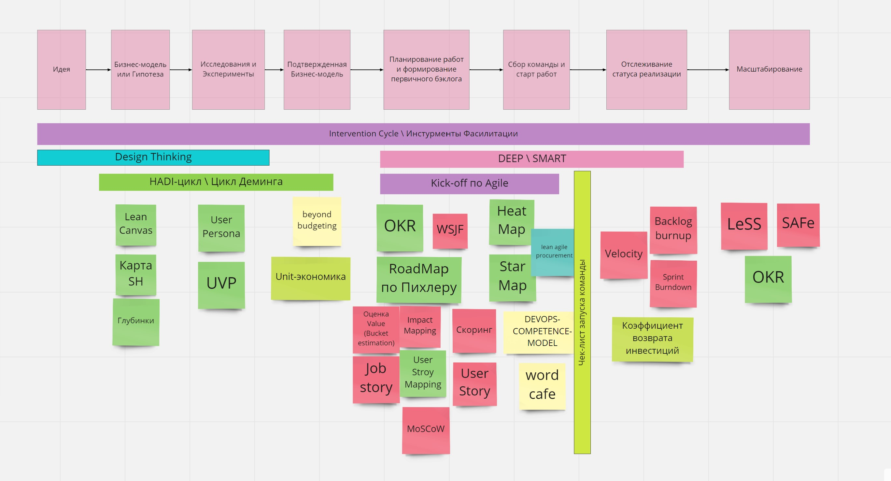

# scrum-master-kit

Набор материалов для быстрого старта Agile проекта в крупной компании. 
Часть материалов не имеет авторства и является предметом коллективного творчества.
Если вы знаете конкретного автора - прошу делать пул реквесты.

## Miro https://miro.com/app/board/o9J_lfHhWjE=/

## Жизненный Цикл Продукта и Интсрументы (Product Life Cycle)

## Материалы 

 * 2017-Scrum-Guide-Russian.pdf - SCRUM Book
 * scrum-poster_preview.jpg  - Потер про SCRUM
 * DEEPPacklog.MD - Что такое DEEP беклог?
 * InterventionCycle.MD - Цикл вмешательства в конфликтную ситуацию
 * ValuePropositionCanvas.png - Шаблон ценностного предложения
 * lean-canvas.jpg - Бережливый шаблон бизнес модели
 * INVEST-UserStory.md - INVEST критерии хорошей User Story
 * DASA-DEVOPS-COMPETENCE-MODEL.pdf - Модель оценки компетенций DevOps
 * agilemanifesto.md - Agile-манифест разработки программного обеспечения

 
 ## Материалы нуждающиеся в переаботке
 * Инстурменты Фасилитации.pdf
 * hadi-Цикл.png
 * Kick-off - последовательность мероприятий по запуску работы команды
 * Чек-лист запуска команды

## Ссылки на источники:
 * https://www.scrumalliance.org
 * https://scrumtrek.ru/
