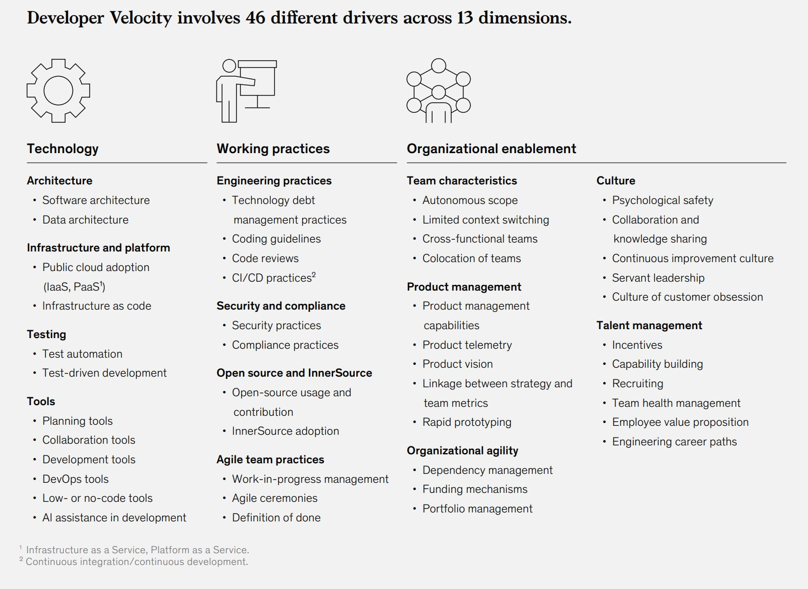

# scrum-master-kit
Набор материалов для быстрого старта Agile проекта в крупной компании. 
Часть материалов не имеет авторства и является предметом коллективного творчества.
Если вы знаете конкретного автора - прошу делать пул реквесты.

## Этапы Жизненного Пути Продукта и Инструменты

## Материалы по Scrum 
 * [2017-Scrum-Guide-Russian.pdf](2017-Scrum-Guide-Russian.pdf) - SCRUM Book 2017
 * [2020-Scrum-Guide-Russian.pdf](2020-Scrum-Guide-Russian.pdf) - SCRUM Book 2020
 * [scrum-poster_preview.jpg](scrum-poster_preview.jpg)  - Поcтер про SCRUM
 * [scrum-daily-meeting.md](scrum-daily-meeting.md) - Ежедневный Скрам (Scrum Daily Meeting)
 

## Материалы по Agile
* [agile-foundation-poster.pdf](agile-foundation-poster.pdf) - постер Agile в двух словах с добавлением идей из Lean 
* [agile-product-ownership-poster.pdf](agile-product-ownership-poster.pdf) - постер Гибкое управление продуктом
* [agilemanifesto.md](agilemanifesto.md) - Agile-манифест разработки программного обеспечения
* [DEEPPacklog.MD](DEEPPacklog.MD) - Что такое DEEP беклог?
* [INVEST-UserStory.md](INVEST-UserStory.md) - INVEST критерии хорошей User Story
* [smart.md](smart.md) - Что такое Smart задачи
* [ОтличияScrumKanban.jpg](ОличияScrumKanban.jpg) - Отличия Scrum и Kanban

## Материалы по Фасилитации и Коучингу 
 * [InterventionCycle.MD](InterventionCycle.MD) - Цикл вмешательства в конфликтную ситуацию
 * [Zuzana_Shokhova_fraemwork.png](Zuzana_Shokhova_fraemwork.png) - Zuzana Shokhova fraemwork 
 * [Agile-Coach-Competency-Framework.jpg](Agile-Coach-Competency-Framework.jpg) - Agile Coach Competency Framework
 * [Facilitation-Tools.pdf](Facilitation-Tools.pdf) - Инструменты  фасилитации
 * `+` Kick-off - последовательность мероприятий по запуску работы команды
 * [Checklist-for-launch-team.md](Checklist-for-launch-team.md) - Чек-лист запуска команды

## Материалы по Техническим практикам и DevOps
 * [DASA-DEVOPS-COMPETENCE-MODEL.pdf](DASA-DEVOPS-COMPETENCE-MODEL.pdf) - Модель оценки компетенций DevOps (+ Miro)
 * [DoD-DoR-Example.md](DoD-DoR-Example.md) - Примеры DoD и DoR
 * `+` CI\CD
 * `+` Git 
 * `+` DevOps, DevSecOps

## Материалы по Бизнес практикам 
 * [ValuePropositionCanvas.png](ValuePropositionCanvas.png) - Шаблон ценностного предложения
 * [lean-canvas-rus.jpg](lean-canvas-rus.jpg) - Бережливый шаблон бизнес модели
 * [okr.md](okr.md) - Суть методики OKR
 * `~` [hadi-Цикл.png](hadi-Цикл.png) - HADI Цикл
 * `~` [Cynefin_Fraemwork.jpg](Cynefin_Fraemwork.jpg) - Cynefin Fraemwork
 * `~` [Good_MVP.jpg](Good_MVP.jpg) - Good_MVP
 * `+` Unit экономика

## Масштабирование гибких подходов
 * `+` SAFe
 * `+` LeSS 
 * `+` Scrum@Scale
 * [okr.md](okr.md) - Постановка целей по OKR

## Производительность разработчиков (Developer Velocity) включает 46 различных драйверов в 13 измерениях.

## Уровень зрелости Developer Velocity (DV) широко варьируется в зависимости от отрасли

### Источник: [Developer-Velocity-How-software-excellence-fuels-business-performance-v4.pdf](Developer-Velocity-How-software-excellence-fuels-business-performance-v4.pdf)

## Проверка знаний 
 * [questions-at-PM-interviews.md](questions-at-PM-interviews.md) - Вопросы на ПМ собеседованиях - интересно из точки зрения как Scrum master может помочь PO\PM

## Неплохая подборка материалов в GIT формате
https://github.com/lorabv/awesome-agile

### Ссылки на источники видения:
 * https://www.scrumalliance.org
 * https://scrumtrek.ru/
 * http://www.chernevsky.ru/
