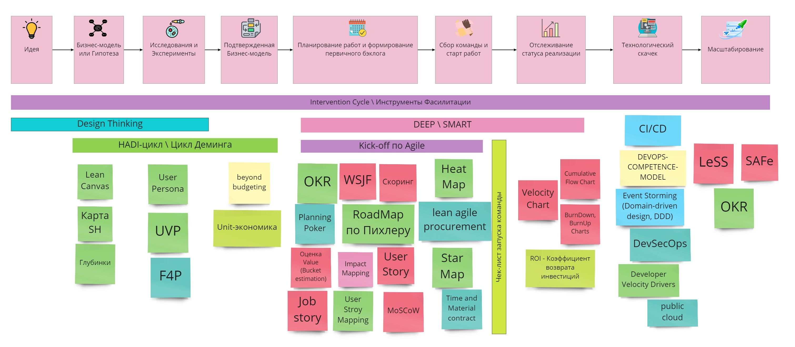

# scrum-master-kit
Набор материалов и ссылок для быстрого старта Agile практик для Development и не только, в крупной компании.

Часть материалов не имеет авторства и является предметом коллективного творчества.
Если вы знаете конкретного автора - прошу делать пул реквесты.

## Мой блог о Agile подходах и менеджменте [msklv.medium.com](https://msklv.medium.com/)

## Этапы Жизненного Пути Продукта и Инструменты

## Материалы по Scrum 
 * [2017-Scrum-Guide-Russian.pdf](pdf/2017-Scrum-Guide-Russian.pdf) - SCRUM Book 2017
 * [2020-Scrum-Guide-Russian.pdf](pdf/2020-Scrum-Guide-Russian.pdf) - SCRUM Book 2020
 * [scrum-poster_preview.jpg](docs/scrum-poster_preview.jpg)  - Поcтер про SCRUM
 * [Medium - Ежедневный Скрам (Daily Scrum) по Scrum Guide 2020](https://msklv.medium.com/%D0%B5%D0%B6%D0%B5%D0%B4%D0%BD%D0%B5%D0%B2%D0%BD%D1%8B%D0%B9-%D1%81%D0%BA%D1%80%D0%B0%D0%BC-daily-scrum-%D0%BF%D0%BE-scrum-guide-2020-1c8f54ed66cd)
 * [Scrum-checker.xlsx](excel/Scrum-checker.xlsx) - Scrum-checker
 * [Medium - Диаграмма сгорания (Burndown Chart) и ее вариации](https://msklv.medium.com/burndown-chart-d46a3747834e)
 
 

## Материалы по Agile
* [agile-foundation-poster.pdf](pdf/agile-foundation-poster.pdf) - постер Agile в двух словах с добавлением идей из Lean 
* [agile-product-ownership-poster.pdf](pdf/agile-product-ownership-poster.pdf) - постер Гибкое управление продуктом
* [agilemanifesto.md](docs/agilemanifesto.md) - Agile-манифест разработки программного обеспечения
* [DEEPPacklog.MD](docs/DEEPPacklog.MD) - Что такое DEEP беклог?
* [Medium - INVEST критерии хорошей User Story](https://msklv.medium.com/invest-user-story-8c200266a3d7) 
* [smart.md](docs/smart.md) - Что такое Smart задачи
* [ОтличияScrumKanban.jpg](docs/ОличияScrumKanban.jpg) - Отличия Scrum и Kanban

## Интументы фасилитации

## Материалы по Фасилитации и Коучингу 
 * [InterventionCycle.MD](docs/InterventionCycle.MD) - Цикл вмешательства в конфликтную ситуацию
 * [Zuzana_Shokhova_fraemwork.png](docs/Zuzana_Shokhova_fraemwork.png) - Zuzana Shokhova fraemwork 
 * [Agile-Coach-Competency-Framework.jpg](docs/Agile-Coach-Competency-Framework.jpg) - Agile Coach Competency Framework
 * [Facilitation-Tools.pdf](pdf/Facilitation-Tools.pdf) - Инструменты  фасилитации
 * [Medium - Kick-off — последовательность мероприятий по переформатированию работы команды по Agile внутри большой компании.](https://msklv.medium.com/kick-off-%D0%BF%D0%BE%D1%81%D0%BB%D0%B5%D0%B4%D0%BE%D0%B2%D0%B0%D1%82%D0%B5%D0%BB%D1%8C%D0%BD%D0%BE%D1%81%D1%82%D1%8C-%D0%BC%D0%B5%D1%80%D0%BE%D0%BF%D1%80%D0%B8%D1%8F%D1%82%D0%B8%D0%B9-%D0%BF%D0%BE-%D0%BF%D0%B5%D1%80%D0%B5%D1%84%D0%BE%D1%80%D0%BC%D0%B0%D1%82%D0%B8%D1%80%D0%BE%D0%B2%D0%B0%D0%BD%D0%B8%D1%8E-%D1%80%D0%B0%D0%B1%D0%BE%D1%82%D1%8B-%D0%BA%D0%BE%D0%BC%D0%B0%D0%BD%D0%B4%D1%8B-%D0%BF%D0%BE-agile-%D0%B2%D0%BD%D1%83%D1%82%D1%80%D0%B8-d5b1e3a351e4)
 * [Medium - Чек-лист проверки запуска команды по Agile в большой компании](https://msklv.medium.com/%D1%87%D0%B5%D0%BA-%D0%BB%D0%B8%D1%81%D1%82-%D0%BF%D1%80%D0%BE%D0%B2%D0%B5%D1%80%D0%BA%D0%B8-%D0%B7%D0%B0%D0%BF%D1%83%D1%81%D0%BA%D0%B0-%D0%BA%D0%BE%D0%BC%D0%B0%D0%BD%D0%B4%D1%8B-%D0%BF%D0%BE-agile-%D0%B2-%D0%B1%D0%BE%D0%BB%D1%8C%D1%88%D0%BE%D0%B9-%D0%BA%D0%BE%D0%BC%D0%BF%D0%B0%D0%BD%D0%B8%D0%B8-a4de0fd34ae3) 
 * [score5teamfaults.md](docs/score5teamfaults.md) - Оценка 5 пороков команды 

## Материалы по Техническим практикам и DevOps
 * [DASA-DEVOPS-COMPETENCE-MODEL.pdf](pdf/DASA-DEVOPS-COMPETENCE-MODEL.pdf) - Модель оценки компетенций DevOps (+ Miro)
 * [DoD-DoR-Example.md](docs/DoD-DoR-Example.md) - Примеры DoD и DoR
 * `+` CI\CD
 * `+` Git 
 * `+` DevOps, DevSecOps
 * [Developer-Velocity-46-drivers.jpg](docs/Developer-Velocity-46-drivers.jpg) - Направления улучшения производительности девелоперов (Developer Velocity Drivers)
 * [Medium - Postmortem Report зачем нужен и как составлять](https://msklv.medium.com/postmortem-report-%D0%B7%D0%B0%D1%87%D0%B5%D0%BC-%D0%BD%D1%83%D0%B6%D0%B5%D0%BD-%D0%B8-%D0%BA%D0%B0%D0%BA-%D1%81%D0%BE%D1%81%D1%82%D0%B0%D0%B2%D0%BB%D1%8F%D1%82%D1%8C-587faefd9f7f) - Postmortem Report зачем нужен и как составлять

## Материалы по Бизнес практикам 
 * [ValuePropositionCanvas.png](docs/ValuePropositionCanvas.png) - Шаблон ценностного предложения
 * [lean-canvas-rus.jpg](docs/lean-canvas-rus.jpg) - Бережливый шаблон бизнес модели
 * `~` [hadi-Цикл.png](docs/hadi-Цикл.png) - HADI Цикл
 * `~` [Cynefin_Fraemwork.jpg](docs/Cynefin_Fraemwork.jpg) - Cynefin Fraemwork
 * `~` [Good_MVP.jpg](docs/Good_MVP.jpg) - Good_MVP
 * [Unit-economics-map-Digital-October.pdf](pdf/Unit-economics-map-Digital-October.pdf) -  Unit экономика
 * [Calc-Unit-Economics.xlsx](excel/Calc-Unit-Economics.xlsx) - Unit экономика расчетная таблица Excel

## Масштабирование гибких подходов
 * `+` SAFe
 * `+` LeSS 
 * `+` Scrum@Scale
 * [Medium - Суть методики OKR](https://msklv.medium.com/%D1%81%D1%83%D1%82%D1%8C-%D0%BC%D0%B5%D1%82%D0%BE%D0%B4%D0%B8%D0%BA%D0%B8-okr-ef91d7505f49) - Суть методики OKR

## Практика
 * [questions-at-PM-interviews.md](docs/questions-at-PM-interviews.md) - Вопросы на ПМ собеседованиях - интересно из точки зрения как Scrum master может помочь PO\PM
 * [Medium - Кейс 1](https://msklv.medium.com/%D0%BA%D0%B5%D0%B9%D1%81-1-erp-%D0%B4%D0%BB%D1%8F-%D1%82%D1%80%D0%B5%D0%B9%D0%B4%D0%B5%D1%80%D0%B0-416d0fb45fb) - ERP для Трейдера (Waterfall)
 * [Medium - Кейс 2](https://msklv.medium.com/%D0%BA%D0%B5%D0%B9%D1%81-2-%D0%BF%D0%BE%D1%80%D1%82%D0%B0%D0%BB-%D0%BC%D0%B0%D1%80%D0%BA%D0%B5%D1%82%D0%BF%D0%BB%D0%B5%D0%B9%D1%81-%D0%B4%D0%BB%D1%8F-%D0%BC%D1%83%D0%BD%D0%B8%D1%86%D0%B8%D0%BF%D0%B0%D0%BB%D1%8C%D0%BD%D0%BE%D0%B9-%D0%BA%D0%BE%D0%BC%D0%BF%D0%B0%D0%BD%D0%B8%D0%B8-89d95e761529) - Портал-маркетплейс для муниципальной компании (ScrumNO)
 * [Medium - Кейс 3 ](https://msklv.medium.com/%D0%BA%D0%B5%D0%B9%D1%81-3-%D0%B2%D1%8B%D0%B2%D0%BE%D0%B4-%D0%BD%D0%B0-eu-%D1%80%D1%8B%D0%BD%D0%BE%D0%BA-%D1%82%D0%B5%D0%BF%D0%BB%D0%BE%D1%82%D0%B5%D1%85%D0%BD%D0%B8%D1%87%D0%B5%D1%81%D0%BA%D0%BE%D0%B5-%D0%BE%D0%B1%D0%BE%D1%80%D1%83%D0%B4%D0%BE%D0%B2%D0%B0%D0%BD%D0%B8%D0%B5-%D0%BF%D0%BE%D0%B4-%D1%81%D0%BE%D0%B1%D1%81%D1%82%D0%B2%D0%B5%D0%BD%D0%BD%D1%8B%D0%BC-%D0%B1%D1%80%D0%B5%D0%BD%D0%B4%D0%BE%D0%BC-df270e4005f6) -  Вывод на EU рынок теплотехническое оборудование под собственным брендом

## Уровень зрелости Developer Velocity (DV) широко варьируется в зависимости от отрасли

### Источник: [Developer-Velocity-How-software-excellence-fuels-business-performance-v4.pdf](pdf/Developer-Velocity-How-software-excellence-fuels-business-performance-v4.pdf)

## Неплохие подборки материалов в GIT формате
 * https://github.com/lorabv/awesome-agile
 * https://github.com/mariuszgil/awesome-eventstorming

### Ссылки на источники видения:
 * https://www.scrumalliance.org
 * https://scrumtrek.ru/
 * http://www.chernevsky.ru/
