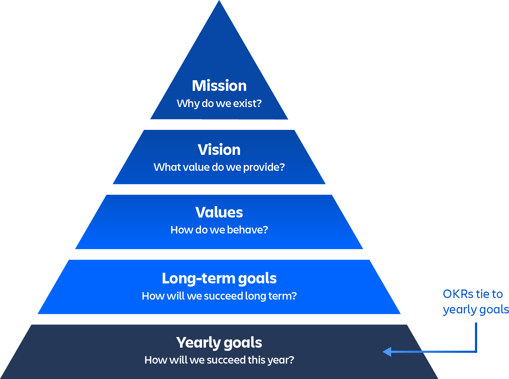
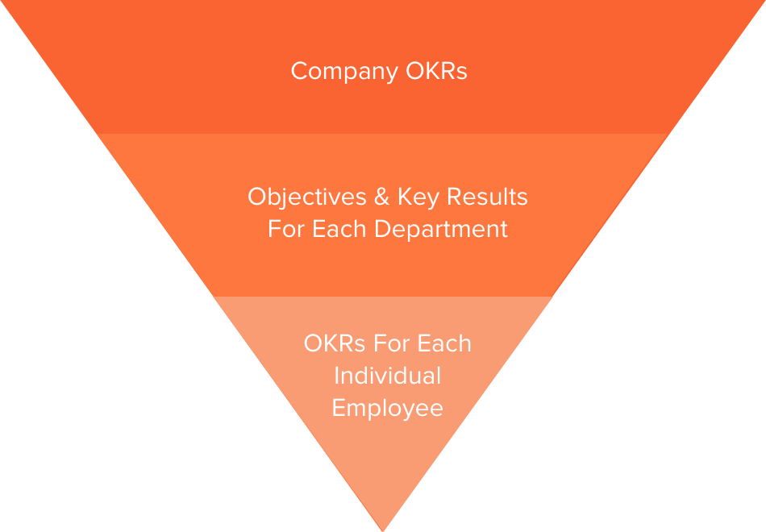

# Суть методики OKR

**Objectives and Key Results, OKR**— система реализации стратегии. Если у вас нет бизнес-стратегии, вы не можете использовать OKR. 

## Ограничения использования
OKR НЕ предназначены для управления и контроля. Не используйте OKR, если хотите контролировать действия людей. 
Используйте OKR только в том случае, если вы хотите направить своих людей к желаемым результатам и доверять им достаточно, чтобы понять, как это сделать.
OKR работают ТОЛЬКО для уполномоченных команд.

## Принципы
Принципы OKR сформулированы Энди Гроувом, создателем методологии:
 - **Честность.** Цели компании и ключевые показатели команд доступны каждому.
 - **Ограниченное количество целей.** Количество целей, поставленных по OKR на каждый цикл, ограничивается от 3 до 5.
 - **Цели формулируются снизу вверх.** Как минимум половина целей должны ставиться самими командами, в идеале — до двух третей.
 - **Не навязывать.** Руководство и сотрудники договариваются о приоритетах и методах оценки.
 - **Гибкость.** Если среда меняется, цели обязательно корректируются.
 - **Завышенные цели.** Если все будут стремится к высокому уровню достижений, результат будет лучше.
 - **OKR — это инструмент.** Методика должна помогать сотрудникам в работе, это не документ для аттестации.
 - **Терпение.** Не стоит бояться неудач, этап проб и ошибок — обязательный процесс.

## Чем не является OKR
 - OKR не система мониторинга и контроля работы подчиненных.
 - Не используется для материальной мотивации — OKR управляет деньгами компании, а не сотрудников.
 - Не подходит для жестких, централизованных систем, подходит — для децентрализованных и запутанных.

Если при традиционном, каскадном, подходе к созданию стратегий, цели спускаются сверху вниз — от руководства к сотрудникам, 
то здесь до двух третей целей устанавливают сами сотрудники. Это повышает вовлеченность и уровень ответственности.

##  Определение целей и ключевых результатов
OKR состоит из двух важных частей: цели, которую вы хотите достичь, и ключевых результатов, с помощью которых вы измеряете достижение цели.

Фелипе Кастро, коуч, автор статей, спикер и специалист по продвижению OKR, кратко описывает два компонента OKR:
> **амбициозные цели (objectives)** — это запоминающиеся качественные описания того, чего вы хотите достичь. Цели должны быть короткими, вдохновляющими и увлекающими. Они должны мотивировать команду и бросать ей вызов.

> **ключевые показатели (key results)** — это набор показателей, значения которых меняются по мере движения к цели. Для каждой цели вам необходимо иметь от двух до пяти ключевых результатов. Если их будет больше — никто их просто не запомнит. Также показатели должны быть поставлены по *SMART* — то есть быть конкретными, измеримыми, достижимыми, обоснованными и ограниченными по времени.

В этом определении есть пара важных моментов. Во-первых, **цель должна быть краткой и увлекающей**, чтобы команда могла легко ее запомнить. Далее должно быть **небольшое количество показателей для отслеживания ключевых результатов**. 
Эти показатели должны представлять из себя что-то, что вы сможете регулярно измерять. Если вы сможете увидеть результаты только через два года, проверять свой прогресс ежеквартально у вас не получится.

#### Чтобы определиться с целями и ключевыми результатами, нужно ответить на два вопроса:
1. Куда я хочу попасть? Или «что я хочу получить?». Ответ даст цель — objective.
2. Как я буду оценивать продвижение к цели? Ответ даст ключевые результаты — key results.

## Отслеживание успеха с помощью OKR
Оценки — это скользящая шкала от 0 до 1, указывающая, достигли вы целевого ключевого результата, приблизились к нему или провалились. 

Пример:
 - 0,3 = вы уделяли недостаточно внимания этой цели
 - 0,7 = вы не достигли цели, но значительно продвинулись
 - 1 = вы достигли вашей амбициозной цели (ура!)

Все правильно: **оценка ключевого результата, равная 0,7, свидетельствует об успехе!** Следует ставить перед собой амбициозные цели, но не чувствовать себя неудачником, если на четверть не дотянули до идеального результата.

Если вы регулярно набираете оценку 1,0 — возможно, следует сделать ключевые результаты еще немного более амбициозными.

## Структура OKR
 - Компания ставит 1-2 Главных цели с определенным запасом — это должны быть достижимые сверхцели. Цели должны поддерживать миссию и ценности компании.
 - Компания ставит от 3 до 5 задач на год и могут обновлять каждый квартал.
 - Каждая команда ставит 3−5 целей, которые согласуются с целями компании на 70-100%. Цели ставятся на квартал с возможностью обновлять 2 недели.
 - Сотрудники совместно с менеджерами устанавливают 3−5 целей, которые синхронизируются с вышестоящими целями на 70-100%. Цели ставятся с возможностью обновлять каждые 2 недели.
 
 

### Источники информации:
 - http://eleganthack.com/cascading-okrs-at-scale/
 - https://www.atlassian.com/ru/agile/agile-at-scale/okr
 - https://www.uplab.ru/blog/okr-how-to-achieve-ambitious-goals/
 
 
### Читайте по теме
 - Перевод статьи Felipe Castro «OKR for Agile Teams» - https://scrumtrek.ru/blog/business-agility/837/okr-for-agile-teams/
 
