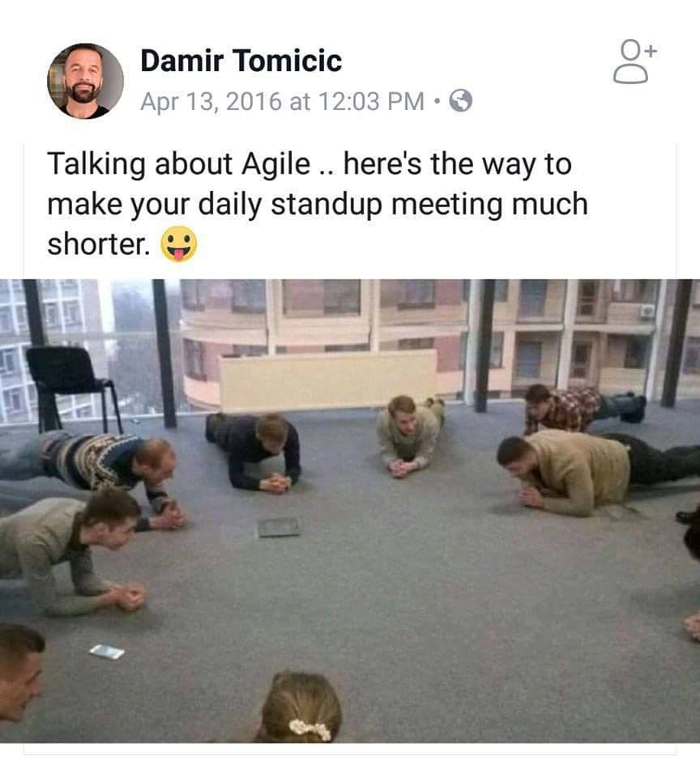

# Ежедневный Скрам (Scrum Daily Meeting)

Это встреча Команды, которая **проводится каждый день** во время Спринта. 

 - Встреча не должна занимать более 15 минут. 
 - Проводится каждый день в одно и то же время.

Команда Разработки использует это событие для инспектирования своего продвижения к Цели Спринта и отслеживания прогресса по работе над Бэклогом Спринта, а также для того, чтобы понять, успевает ли она завершить задачи Спринта в срок. 

Проведение Ежедневного Скрама увеличивает вероятность, что Команда достигнет Цели Спринта. 

Команда сама определяет формат встречи, но акцент всегда остается на достижении Цели Спринта. 

-------------------------

### Можно использовать вопросы, например:
 - Что я сделал вчера, что помогло Команде Разработки приблизиться к Цели Спринта?
 - Что я сделаю сегодня, чтобы помочь Команде Разработки достичь Цели Спринта?
 - Вижу ли я какие-либо препятствия, которые могут помешать мне или Команде Разработки достичь Цели Спринта?

-------------------------

Часто сразу после Ежедневного Спринта Команда в полном составе или её отдельные участники встречаются для более детального обсуждения, или для изменения, 
или перепланирования оставшейся в Спринте работы.

Скрам-мастер следит, чтобы встреча Команды Разработки состоялась, но за проведение Ежедневного Скрама отвечает сама команда. 
Скрам-мастер обучает Команду Разработки проводить Ежедневный Скрам **за 15 минут или быстрее**.

Ежедневный Скрам — это **внутренняя встреча Команды**. Если на ней присутствует кто-то ещё, Скрам-мастер следит, **чтобы они не мешали встрече**.
Ежедневный Скрам улучшает коммуникации, делает другие встречи ненужными, помогает выявить препятствия в разработке, которые необходимо устранить. 
Он способствует и поощряет быстрое принятие решений, повышает уровень знаний Команды.
Это ключевая встреча для Инспекции и Адаптации.
